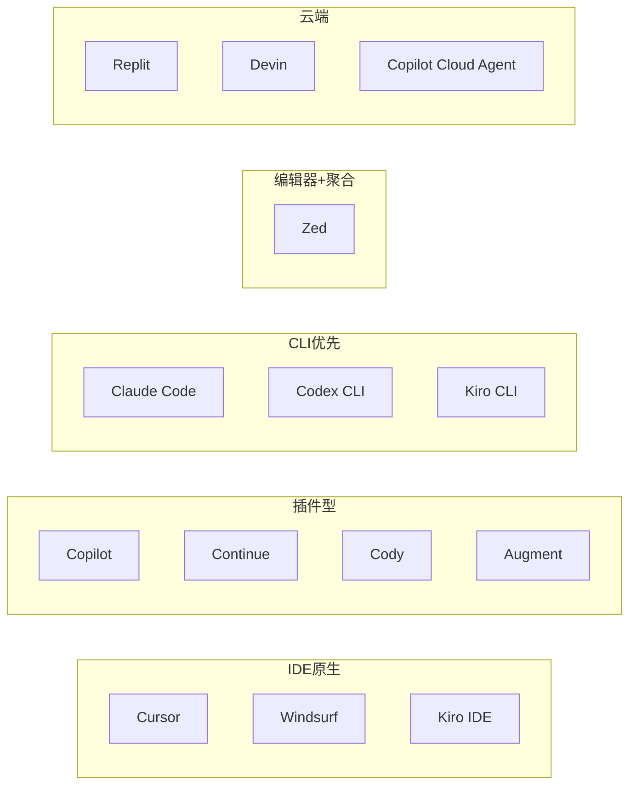

# 主流 Agent IDE 工具对比（2026）

> 文档整理时间：2026 年 5 月。Agent IDE 市场变化很快，定价、模型与功能以各厂商官网为准。

## 1. 什么是 Agent IDE

**Agent IDE**（或称 AI-native IDE / Agentic coding environment）指将大模型深度嵌入开发流程，使 AI 不仅能补全单行代码，还能：

- 理解整个代码库（索引、语义检索、跨文件依赖）
- 自主规划多步任务（读文件、改代码、跑终端、跑测试）
- 在后台或云端完成 issue → PR 等端到端工作流

与早期「聊天 + 补全」型 Copilot 不同，2025–2026 年的主流产品普遍强调 **Agent 模式**：可编辑多文件、执行命令、接入 MCP/外部工具，并支持项目级规则文件（如 `AGENTS.md`、`CLAUDE.md`）。

---

## 2. 产品一览

| 产品 | 形态 | 核心 Agent 能力 | 典型定价（个人） | 最适合 |
|------|------|-----------------|------------------|--------|
| **Cursor** | VS Code Fork 独立 IDE | Composer / Agent / Background Agents | 免费 → ~$20/月 Pro | 追求一体化、多文件 Agent 体验的团队 |
| **Windsurf** | VS Code Fork + 多 IDE 插件 | Cascade 流式 Agent | 免费 → ~$15/月 Pro | 成本敏感、需多 IDE/强合规的团队 |
| **GitHub Copilot** | VS Code / JetBrains / Neovim 等插件 | IDE Agent + Coding Agent（云端 issue→PR） | 免费 → ~$10–19/月 | 已深度使用 GitHub 的组织 |
| **Sourcegraph Cody** | 插件 + 企业平台 | 聊天 + 多文件编辑（偏企业审计） | 企业定制（通常较高） | 超大单体/多仓库、需代码图谱的企业 |
| **Continue.dev** | VS Code / JetBrains 插件 | Agent + 可配置上下文 | 开源免费 + Hub 付费 | 要开源、自托管、自选模型的团队 |
| **Claude Code** | CLI + Desktop + 编辑器扩展 | 终端原生 Agent、MCP 生态 | Pro/Max 订阅或 API 计费 | 终端党、复杂自动化与 MCP 集成 |
| **OpenAI Codex** | CLI / ChatGPT 云端 | 云端自主编码 Agent | ChatGPT / API 套餐 | OpenAI 生态、云端委托任务 |
| **Augment Code** | VS Code / JetBrains 插件 | Context Engine + 任务清单式 Agent | 按积分/企业合同 | 超大 monorepo、强企业治理 |
| **Zed** | 自研高性能编辑器 | Agent Panel + 外部 Agent（ACP） | Pro 订阅或 BYOK | 重视性能、愿组合多种 CLI Agent |
| **Kiro**（原 Amazon Q Developer） | 独立 IDE + CLI + JetBrains ACP | Spec 驱动开发、Agentic 编码 | AWS/Kiro 订阅 | AWS 用户、规范驱动工作流 |
| **Replit Agent** | 云端 IDE | 全栈生成 + 一键部署 | Replit 订阅 | 非技术用户、快速原型 |
| **Devin**（Cognition） | 云端自主工程师 | 端到端任务（偏产品化） | 企业定价 | 委托式、少本地交互的场景 |

---

## 3. 分产品优缺点

### 3.1 Cursor

**定位**：AI-native IDE 标杆，基于 VS Code Fork，把索引、聊天、内联编辑、多文件 Agent 做成统一体验。

| 优点 | 缺点 |
|------|------|
| Composer / Agent 多文件编辑成熟，接受率与 UX 口碑领先 | 必须使用 Cursor 编辑器，工作流绑定较深 |
| 代码库索引与上下文窗口较大（业界常见约 200K 级） | 无完全自建/本地推理；隐私敏感行业可能受限 |
| 支持多前沿模型切换；Background Agents 可云端并行 | Pro ~$20/月，Ultra 等档位对团队成本明显 |
| 插件市场、子 Agent 等生态在快速扩展 | JetBrains 支持相对晚于 Copilot/Windsurf |
| SOC 2 等企业能力（Business 档） | 强监管行业若要求完全 on-prem，需评估替代方案 |

**适合**：日常在 VS Code 体系、希望「开箱即用」最强 Agent 体验的专业开发者与成长型团队。

---

### 3.2 Windsurf（原 Codeium）

**定位**：强调 **Cascade** 自主 Agent 流、会话感知（观察你的编辑/测试行为自动更新上下文），兼有多 IDE 插件。

| 优点 | 缺点 |
|------|------|
| Cascade Agent 响应快，Pro 定价常低于 Cursor | 同为 VS Code Fork，与 Cursor 体验重叠度高 |
| 插件覆盖 JetBrains、Vim、Xcode 等 40+ IDE | 品牌与收购变动（OpenAI/Cognition 等）带来路线不确定性 |
| 企业合规认证较全（SOC 2、HIPAA、FedRAMP 等报道） | 自托管选项曾进入维护模式，新购 on-prem 需核实现状 |
| SWE 系列自研模型在部分场景降低 token 成本 | 与 Cursor 比，社区教程与第三方集成仍略少 |
| Memories / 长会话上下文对长期项目友好 | 深度 GitHub issue→PR 原生流程弱于 Copilot |

**适合**：既要 Agent IDE，又不愿离开 JetBrains；或看重性价比与企业安全认证的团队。

---

### 3.3 GitHub Copilot

**定位**：覆盖面最广的 AI 编程助手，2026 年重点升级为 **Copilot coding agent**（后台 issue→PR）、IDE 内 Plan/Custom agents、CLI Agent。

| 优点 | 缺点 |
|------|------|
| 与 GitHub Issues、PR、Code Review、Actions 原生打通 | IDE 内 Agent 体验仍偏「插件」，不如 Cursor 一体化 |
| 支持 VS Code、JetBrains、Visual Studio、Neovim 等 | 最强 Agent 能力依赖 GitHub 账号与云端，离线弱 |
| Coding Agent 可自审、安全扫描后再开 PR | 复杂多文件重构的「编辑器内」流畅度常逊于 Cursor |
| Custom agents（`.github/agents/`）、AGENTS.md、MCP、Hooks | 企业定价与席位管理需与 GitHub Enterprise 一并规划 |
| 个人档 ~$10/月起，性价比在一线产品中突出 | 模型与功能随计划（Pro/Business/Enterprise）差异大 |

**适合**：代码托管在 GitHub、希望「分配 issue → 收 PR」工作流的企业；JetBrains 重度用户。

---

### 3.4 Sourcegraph Cody

**定位**：背靠 Sourcegraph **代码图谱** 与跨仓库搜索，擅长超大、多仓库企业的「理解代码」而非单纯生成。

| 优点 | 缺点 |
|------|------|
| 组织级、多仓库上下文能力强 | 企业合同价高，中小团队门槛大 |
| 支持自托管，强调不向外部发送客户代码 | 日常多文件 Agent 编辑体验不如 Cursor/Windsurf 顺滑 |
| 与 Sourcegraph 搜索、Code Intelligence 一体 | 配置与运维复杂度高于 SaaS IDE |
| 无训练客户代码、零保留等合规承诺 | 个人开发者场景并非主战场 |

**适合**：已有 Sourcegraph、需要 org-wide 代码智能与审计的大型企业。

---

### 3.5 Continue.dev

**定位**：**开源**（Apache 2.0）AI 助手，强调模型自由、配置进仓库、可本地部署。

| 优点 | 缺点 |
|------|------|
| 任意 LLM（Claude、GPT、Ollama 本地等） | 默认体验需自行调模型与 context，上手曲线陡 |
| 无厂商锁定 IDE，继续用 VS Code / JetBrains | Agent 与索引 polish 仍弱于 Cursor |
| 可完全离线/自托管，适合合规与成本控 | 团队统一配置需要工程化投入 |
| 插件免费，主要成本为 API 或自有算力 | Hub 付费功能与开源边界需团队自行评估 |

**适合**：要审计代码路径、混用本地模型、或不愿换编辑器的安全敏感团队。

---

### 3.6 Claude Code

**定位**：Anthropic **终端优先**的 Agent，通过 `CLAUDE.md`、Hooks、Skills、**MCP** 扩展能力极强。

| 优点 | 缺点 |
|------|------|
| MCP 生态成熟（数据库、Slack、Sentry 等） | 默认无 GUI，非终端用户学习成本高 |
| 与编辑器解耦，可配 Vim/Neovim/Zed/VS Code | 重度依赖 Anthropic 模型与计费 |
| 支持 headless/CI（`-p` 等） | 安全扫描等能力在 Web 版更强，CLI 需自行补齐 |
| 长上下文与 SWE-bench 类任务表现领先 | 与 Cursor 等比，缺少统一 diff/内联 UX |
| Desktop 版提供可视化 diff、预览 | 订阅与 API 并行，成本需单独核算 |

**适合**：资深工程师、DevOps/平台组、需要把 Agent 嵌入脚本与 CI 的场景。

---

### 3.7 OpenAI Codex（CLI / 云端）

**定位**：OpenAI 体系下的 CLI Agent 与 ChatGPT 内 **云端自主编码 Agent**。

| 优点 | 缺点 |
|------|------|
| 与 GPT 系列模型、ChatGPT 账号体系统一 | CLI 侧 MCP/工具生态仍追赶 Claude Code |
| 云端 Agent 适合委托长任务 | 本地环境深度调试不如 Claude Code 直接 |
| 适合已采购 OpenAI 的企业 | 与 Cursor/Windsurf 的 IDE 一体化竞争处于不同赛道 |

**适合**：OpenAI 全家桶用户、愿在 ChatGPT/云端完成委托式开发的用户。

---

### 3.8 Augment Code

**定位**：面向 **企业 monorepo** 的 Context Engine + IDE Agent，另有 Cosmos 组织级 Agent 平台。

| 优点 | 缺点 |
|------|------|
| 语义索引跨仓库、依赖与历史，非简单 grep | 定价按积分/合同，个人与小团队不友好 |
| 任务清单式规划后再改代码，可审查步骤 | 市场声量小于 Cursor/Copilot |
| VS Code + JetBrains；原生集成 GitHub/Jira/Linear 等 | 功能迭代快，文档与社区案例相对少 |
| 企业 SSO、RBAC、审计、无训练承诺 | 与 Cody 类似，偏「买平台」而非「买编辑器」 |

**适合**：数百人以上、多仓库、需要统一上下文与治理的 engineering org。

---

### 3.9 Zed

**定位**：Rust 实现的高性能编辑器，通过 **Agent Panel** 与 **ACP** 接入 Zed Agent、Claude Code、Codex、Copilot 等。

| 优点 | 缺点 |
|------|------|
| 编辑器性能与协作（多人）体验突出 | 生态小于 VS Code，部分语言/插件仍缺 |
| BYOK + 多提供商 + Ollama 本地 | 内置 Zed Agent 能力仍在快速迭代 |
| Terminal Threads 可原样跑 `claude`/`codex` CLI | 从 VS Code 迁移有习惯成本 |
| 外部 Agent 与 MCP 转发设计清晰 | Windows/Linux 功能成熟度 historically 弱于 macOS |

**适合**：追求编辑器性能、希望「一个面板管多个 Agent」而不想被单一 SaaS IDE 锁死的开发者。

---

### 3.10 Kiro（Amazon Q Developer 继任）

**定位**：AWS 推出的 **规范驱动（Spec-driven）** Agent IDE/CLI；Q Developer IDE 插件将于 **2027-04-30** 结束支持。

| 优点 | 缺点 |
|------|------|
| 从需求/规格到实现、验证的闭环 | Q → Kiro 迁移期，文档与心智负担 |
| 保留 Q 的 inline/chat/agent，增加 Hooks、Steering、Powers | 非 AWS 技术栈团队吸引力有限 |
| JetBrains 通过 ACP 接入 | Visual Studio / Eclipse 无原生 Kiro 插件 |
| MCP、终端 allow/deny 列表等企业控制 | 最新模型（如 Opus 4.7）优先在 Kiro，旧 Q 订阅受限 |

**适合**：AWS 重度用户、希望 Spec 驱动与云资源文档深度结合的团队。

---

### 3.11 Replit Agent

**定位**：**云端全栈** Agent，从自然语言到前后端、数据库、部署一条龙。

| 优点 | 缺点 |
|------|------|
| 零本地环境，一键部署 | 不适合大型既有 monorepo 迁移 |
| 非开发者也能做 MVP | 代码在企业自有仓库的深度集成弱 |
| 内置 DB、Auth、托管 | 长期维护与供应商锁定需评估 |
| 适合教学、黑客松、创业验证 | 企业合规与私有部署选项有限 |

**适合**：快速原型、教育、独立开发者；而非传统大企业主 IDE。

---

### 3.12 Devin（Cognition）

**定位**： marketed 为「AI 软件工程师」，偏 **云端自主** 完成端到端任务（Windsurf 同属 Cognition 生态）。

| 优点 | 缺点 |
|------|------|
| 强调长任务自治与 SWE 类 benchmark | 价格高、以企业销售为主 |
| 适合明确外包式任务 | 可控性、可审计性因团队而异 |
| 与 Windsurf 等产品战略协同 | 本地 IDE 细粒度交互不如 Cursor |

**适合**：愿为「委派整票工程任务」付费、有成熟 code review 流程的团队。

---

## 4. 维度横向对比

### 4.1 架构形态

### 4.2 关键能力矩阵（简化）

| 能力 | Cursor | Windsurf | Copilot | Cody | Continue | Claude Code | Augment | Zed |
|------|:------:|:--------:|:-------:|:----:|:--------:|:-----------:|:-------:|:---:|
| 多文件 Agent | ★★★ | ★★★ | ★★☆ | ★★☆ | ★★☆ | ★★★ | ★★★ | ★★☆ |
| 代码库索引 | ★★★ | ★★★ | ★★☆ | ★★★ | ★★☆ | ★★☆ | ★★★ | ★★☆ |
| 跨仓库/企业上下文 | ★★☆ | ★★☆ | ★★☆ | ★★★ | ★☆☆ | ★☆☆ | ★★★ | ★☆☆ |
| JetBrains 原生 | ★☆☆ | ★★★ | ★★★ | ★★★ | ★★★ | ★★☆ | ★★★ | ★☆☆ |
| 本地/自托管模型 | ✗ | △ | ✗ | △ | ★★★ | △ | △ | ★★★ |
| MCP / 自定义工具 | ★★☆ | ★★☆ | ★★★ | ★★☆ | ★★★ | ★★★ | ★★★ | ★★★ |
| GitHub issue→PR | △ | △ | ★★★ | △ | △ | ★★☆ | ★★☆ | △ |
| 开源可审计 | ✗ | ✗ | ✗ | 部分 | ★★★ | ✗ | ✗ | 部分 |

（★ 为相对强弱示意，非官方评分。）

### 4.3 成本与锁定风险（定性）

| 产品 | 订阅门槛 | 锁定风险 | 备注 |
|------|----------|----------|------|
| Cursor | 中 | IDE + 云模型 | 时间价值高时 ROI 通常为正 |
| Windsurf | 低–中 | IDE/插件双轨 | 多 IDE 降低编辑器锁定 |
| Copilot | 低 | GitHub 生态 | 换托管成本高 |
| Continue | 低（API 另计） | 低 | 配置在 Git 中可迁移 |
| Claude Code | 中–高 | 模型供应商 | MCP 投资可迁移到其他 MCP 客户端 |
| Cody / Augment | 高 | 平台与合同 | 适合已购企业搜索/治理平台者 |

---

## 5. 选型建议（按场景）

1. **默认「最强开箱 Agent IDE」** → **Cursor**  
   若团队已全员 VS Code 且预算允许，多数 2026 年评测将其列为综合体验第一梯队。

2. **GitHub 为中心的研发组织** → **GitHub Copilot**（+ Coding Agent）  
   issue 分配、PR 自审、组织级 Secrets、Code Scanning 一体化时优势明显。

3. **JetBrains 为主 + 要 Agent** → **Windsurf 插件** 或 **Copilot**；评估 **Augment** 若 monorepo 极大。

4. **合规 / 本地模型 / 零订阅** → **Continue.dev** 或 **Zed + Ollama/BYOK**。

5. **终端 + MCP + CI 自动化** → **Claude Code**；OpenAI 用户可并行评估 **Codex CLI**。

6. **多仓库企业代码智能** → **Sourcegraph Cody** 或 **Augment**（视是否已有 Sourcegraph）。

7. **AWS + 规格驱动** → **Kiro**（并规划从 Q Developer 迁移）。

8. **原型与教学** → **Replit Agent**。

9. **不想换 IDE，但要聚合多个 Agent** → **Zed**（ACP + Terminal Threads）。

---

## 6. 趋势与注意点（2026）

- **Agent 与 Copilot 边界模糊**：补全、聊天、Plan、Agent、Cloud Agent 往往在同一产品内分层售卖。  
- **规则文件标准化**：`AGENTS.md`、`CLAUDE.md`、`.github/agents/` 等成为团队「可版本化」的 AI 行为配置。  
- **MCP 成为扩展主轴**：数据库、工单、监控接入方式趋同，选型时需看 MCP 成熟度与审批策略。  
- **云端 vs 本地**：Background / Cloud Agent 提升并行度，但带来代码出境与审计要求。  
- **定价模型分化**：固定月费、积分制、API 透传、订阅内 Agent 额度（如 Claude 在部分宿主上的额度变化）需单独测算。  
- **并购与更名**：Windsurf ↔ Cognition/OpenAI、Q Developer → Kiro 等，采购时建议看 **12–24 个月路线图** 而非仅当前功能表。

---

## 7. 参考链接

- Cursor: https://cursor.com  
- Windsurf: https://windsurf.com  
- GitHub Copilot / Coding agent: https://github.com/features/copilot  
- Sourcegraph Cody: https://sourcegraph.com/cody  
- Continue: https://continue.dev  
- Claude Code: https://docs.anthropic.com/en/docs/claude-code  
- OpenAI Codex: https://openai.com/codex  
- Augment: https://www.augmentcode.com  
- Zed Agent: https://zed.dev/docs/ai/agent-panel  
- Kiro: https://kiro.dev  
- Replit Agent: https://replit.com  

---

## 8. 免责声明

本文基于 2026 年 5 月前后的公开资料与行业评测整理，**非任何厂商的官方文档**。实际功能、价格、合规认证与可用地区请以各产品最新条款为准。建议在试点阶段用同一套真实任务（如「跨 5 文件重构 + 补测试 + 开 PR」）对 2–3 款候选工具做两周对比，再决定团队标准工具链。
